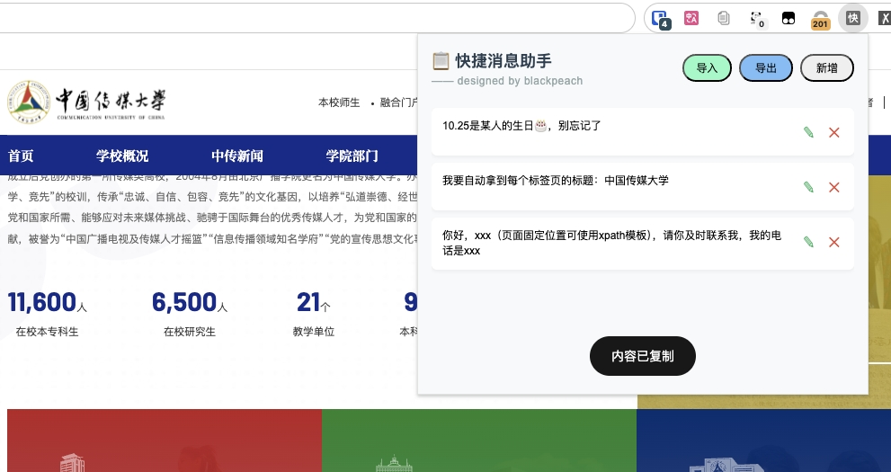
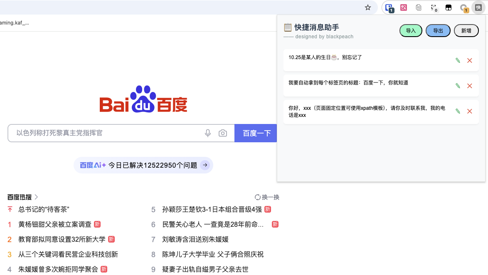

# 快捷消息助手 Chrome 扩展

 

 

一款高效的Chrome扩展插件工具，帮助快速生成和复制预设消息模板，支持新增、编辑、删除、复制等功能

## 适用场景

- 可当作备忘录
- 可记录高频话术，方便复制粘贴
- 可定制xpath消息模板，所以消息可定制化程度高

## ✨ 核心功能

- **动态模板引擎**  
  使用XPath自动抓取页面元素值，支持`{{xpath}}`语法实时解析
    - 例如，「默认收货地址：{{//div[@id='address']}}」，经过渲染可能是，「默认收货地址：北京市海淀区北京大学」
- **高效编辑功能**  
  - 自适应高度文本框
  - 点击扩展空白处自动保存
- **人性化复制功能** 
  - 点击消息即可复制
- **即时反馈系统**  
  - 复制成功动画提示

## 后续计划新增功能

- 消息标签，支持分组

## 🛠️ 安装指南

# 浏览器加载步骤

1. 下载后解压压缩包
2. 访问 chrome://extensions/
3. 开启"开发者模式" 
4. 点击"加载已解压的扩展程序"
5. 选择项目根目录，或直接将文件夹拖入
6. 即可食用，建议置顶，便于寻找